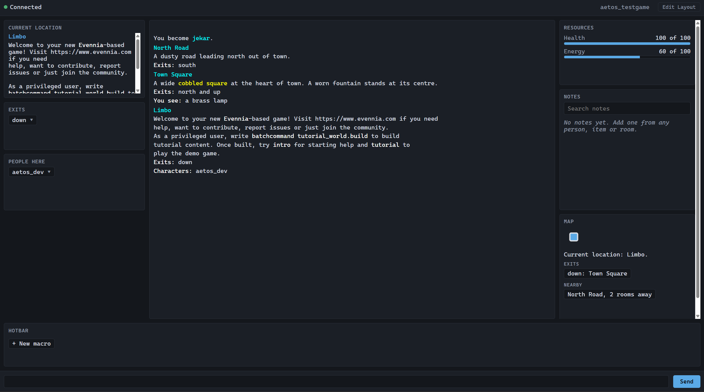

# Aetos Web Client

A genre-agnostic graphical webclient framework for [Evennia](https://www.evennia.com).



Aetos replaces the stock webclient interface while leaving Evennia's transport
layer — `evennia.js` and the Portal websocket — completely untouched.

Install it and you immediately get a better client on an ordinary Evennia game,
with no changes to your game code. Teach it about your game's data and it becomes
your game's graphical interface.

Aetos assumes nothing about genre, combat, magic, character model, map format,
inventory or resources. **Anything a game does not expose simply does not appear** —
you never get an empty widget implying a system you do not have.

---

**Status:** 16 feature milestones + accessibility foundation · 467 Python tests · axe clean · no framework, no build step, no CDN

### Working today

**Zero configuration** — install it on a stock Evennia game and you get a
console with full colour, room/exits/people/items panels, inventory, a local map
built by walking exits you can actually see, context menus on everything, and
click-to-walk routing. No game code required.

**When your game exposes it** — resource meters with thresholds, equipment by
slot, current target, and temporary effects. Declare nothing and nothing
appears; you never get an empty widget implying a system you do not have.

**Player tools, stored only in the browser** — macros and a hotbar, aliases,
triggers, timers, a sandboxed scripting language, private notes and relationship
tags, map notes, a command palette (`Ctrl+K`), searchable in-client help (`F1`),
layout editing, workspaces, and a responsive layout from phone to wide monitor.

### Accessibility is a first-class citizen, not a later pass

Accessibility is one of the mechanisms by which this client is built, not an
alternate presentation bolted on afterwards. It is governed by
[**Addendum A**](docs/addendum-a-accessibility.md), a normative specification
whose `A11Y-` requirement IDs are **release gates**. Core accessibility
behaviour cannot be switched off by a game developer — a developer decides
whether scripting is allowed, not whether a player gets a usable interface.

Already true today:

- **Everything is keyboard-operable.** Nothing in Aetos requires a mouse, and
  dragging is never the only way to do anything.
- **Combat spam never floods speech.** The transcript is `role="log"` with
  `aria-live="off"` set deliberately, so a screen reader is not made to read
  every line the moment it arrives — the full text stays reviewable.
- **One announcer, not thirty.** A single central live region; no widget owns
  its own, so nothing competes for speech.
- **No character-only shortcuts.** Aetos ships `Ctrl+K`, `Ctrl+Shift+L` and
  `F1` — never bare letters, which NVDA and JAWS need for structural navigation.
- **Colour never carries meaning alone.** Severity, effect tone and status are
  written in words; colour only reinforces them.
- **The map has a written equivalent** generated from the *same* graph as the
  picture, so the two cannot disagree.
- **Game events never steal focus**, and dialogs return focus where they found
  it.
- **Countdowns are not announced every second** — and an effect reaching zero
  shows as *expiring* rather than vanishing, because only the server knows when
  it truly ended.

Next up, and blocking all further feature work: **A0, the Accessibility
Foundation** — skip links, a rebindable shortcut manager, a prioritised
announcement manager, granular accessibility preferences, and an automated axe
gate. After that come a Current State View, Review Mode with flood control,
cognitive supports (*Reorient Me*, *How I Got Here*, *Quiet Mode*), AAC and
picture-supported communication, and validation against NVDA, JAWS, Orca and
refreshable braille.

> Honest wording, per Addendum A.100: this project is **designed toward
> WCAG 2.2 AA**. It does not claim compliance, JAWS compatibility or braille
> compatibility until the assistive-technology testing that would justify those
> claims has actually happened.

### For game developers

Zero configuration gets you a working client. Beyond that the plan is a
declarative `AETOS_BINDINGS` layer — *"my health is at `db.hp`"* — and
`evennia aetos discover`, a development-time tool that inspects your own game
and suggests those bindings, with its evidence and its confidence shown. You
write a provider class only when a value is genuinely calculated rather than
stored. See [the easy button](#teaching-it-about-your-game).

### The engine promise

Structured state is authoritative; automation observes it; **presentation may
change how information is shown but never what actually happened**. A line you
hide from view still fires its trigger, still reaches Review Mode, and is still
recoverable from canonical history — because hiding is a display choice, not a
deletion.

Coming with that: session capture and replay, so an accessibility bug that
happened once can be reproduced deterministically without recreating the game
situation that caused it.

### On the roadmap

Rich chat and event history · audio and multimedia with captions · themes with
High Contrast in core · a PWA shell and touch gestures · a developer inspector ·
a documented widget SDK · a server-described UI manifest · reconnect,
performance and security hardening · voice input.

Full detail: [what is built](#what-is-built) · [what is left](#what-is-left) ·
[roadmap](notes/roadmap.md) · [changelog](CHANGELOG.md)

---

## Quick start

Requires an existing Evennia game. Nothing else — no Node, no build step, no CDN.

**1. Get the contrib into your Evennia**

```bash
cp -r contrib/aetos_webclient "$(python -c 'import evennia,os;print(os.path.dirname(evennia.__file__))')/contrib/base_systems/"
```

**2. Add three lines to `server/conf/settings.py`**

```python
from evennia.contrib.base_systems.aetos_webclient import AETOS_TEMPLATE_DIR

INSTALLED_APPS += ["evennia.contrib.base_systems.aetos_webclient"]
TEMPLATES[0]["DIRS"].insert(0, AETOS_TEMPLATE_DIR)
INPUT_FUNC_MODULES.append("evennia.contrib.base_systems.aetos_webclient.inputfuncs")
```

**3. Restart**

```bash
evennia reload
```

Aetos now serves at your existing webclient URL (`/webclient/` by default). No
files are copied into your game directory and no Evennia file is modified. To
uninstall, delete the three lines and restart.

> `WEBCLIENT_TEMPLATE = "aetos"` does **not** work for this. Evennia builds the
> `TEMPLATES` list at import time in `settings_default`, so reassigning it in
> your own settings has no effect on the already-built list. The `DIRS.insert`
> is what makes Aetos win.

**4. Press `F1`**

Aetos documents itself. `F1` opens a searchable reference covering every feature
with worked examples, and `Ctrl+K` opens the command palette.

That is the whole installation. Everything below is optional — and if you want
the shortest path from here to *your* game's health bars appearing, read
[the easy button](#the-easy-button) next.

---

## The easy button

*Planned — the D-track. Described here because it is the intended path, and
because knowing it is coming should stop you writing a provider class you may
not need.*

**The fastest route from install to playing your own game**, for a developer who
does not want to learn how Aetos works first.

It is entirely optional. Aetos works without it, and you can skip straight to
[bindings](#level-1--tell-aetos-where-your-data-is-planned-d-track) or
[providers](#level-2--write-a-provider) if you already know where your data
lives.

```bash
evennia aetos discover
```

### What it actually does

Nothing hidden, nothing clever, and nothing you cannot check. Six steps:

**1. It asks which character to look at.**
By dbref, by key, or whichever one you have puppeted. It tells you exactly what
it picked, so you are never guessing which object it is describing.

```text
Inspecting:  #42 TestCharacter
Typeclass:   typeclasses.characters.Character
```

**2. It looks — three ways, and says which found what.**
Your live character's attributes and their types; your typeclasses, command sets
and command keys; and, optionally, your source under `typeclasses/`, `commands/`
and `world/` — parsed, never executed. A file containing `os.system(...)` sits
there inert.

**3. It shows you what it found, and why it thinks so.**
Every suggestion carries its evidence and how confident it is. You are never
asked to trust a scanner you cannot interrogate.

```text
Possible resource found
-----------------------
Suggested name:  Health
Current:         db.hp
Maximum:         db.hp_max
Test values:     82 / 100

Evidence:
  ✓ both attributes exist        ✓ names appear related
  ✓ both are numeric             ✓ current <= maximum

Confidence: HIGH

[Y] Use   [E] Edit   [N] Ignore   [?] Explain
```

**4. You correct anything it got wrong.**
Edit the label or either path in place. No Python, no file editing.

**5. It tests the binding against your live character before generating
anything.**

```text
Testing db.hp...       ✓ found  ✓ integer  ✓ 82
Testing db.hp_max...   ✓ found  ✓ integer  ✓ 100

Preview:  Health 82/100
```

This is the step that earns the whole tool. A typo in a path is otherwise
discovered as a silently empty widget after a reload, which is the single most
annoying way to learn you made a mistake.

**6. It writes suggestions to a directory and stops.**

```text
aetos-discovery/
├── report.md
├── suggested_bindings.py
└── suggested_provider.py    (only if your game needs one)
```

You read it, you paste what you want into `settings.py`, you reload.

### What it will not do

This is the transparent part, and it is deliberate:

- **It never edits your game.** Not `settings.py`, not your typeclasses, not
  your commands. It writes to its own directory and leaves the decision to you.
- **It never executes your code.** Source is parsed with Python's `ast` module
  and discarded. Nothing is imported, instantiated or called.
- **It never runs during play.** It is a development-time command. There is no
  protocol message that reaches it, so a connected player has no route in.
- **It never leaves your machine.** No upload, no telemetry, no "phone home".
- **It redacts anything that looks like a credential** — `password`, `token`,
  `api_key` and friends are reported as `<redacted>` and never become
  suggestions.
- **It stays out of directories that are none of its business** — `.env`,
  `.git/`, virtualenvs, logs, keys, backups, `node_modules/`, and anything
  outside your game via a symlink.
- **It will not guess.** Where two candidates both fit, it says so and asks:

  ```text
  Two possible maximum-health fields found.
    db.max_hp
    db.hp_cap
  Aetos cannot determine which is correct.
  ```

  `unknown` is preferable to wrong, everywhere in Aetos.

### And it will tell you when it cannot help

If a value is *calculated* rather than stored — a method call, a derived stat —
a binding genuinely cannot express it, and Discovery says so instead of
generating something that half-works:

```text
This integration requires Python logic.

Observed pattern:
  character.stats.get("health").current

AETOS_BINDINGS does not allow method calls.

Recommended:
  Custom AetosResourceProvider
```

It can generate a starter provider for that case, labelled
**GENERATED STARTER CODE — REVIEW BEFORE USE**, because static analysis cannot
know what you meant.

### The bar it has to clear

The acceptance test is deliberately unforgiving: hand an Evennia developer who
has never seen Aetos a game with `db.hp` and `db.hp_max`, this README, and no
help. They must reach working resource meters on their own.

> If they have to write a provider class, the easy button has failed.

Design detail: [Addendum B](docs/addendum-b-discovery.md).

---

## Teaching it about your game

Three levels. Most games never need the third.

#### Level 0 — nothing

You already have a working client: console, room, exits, people, items,
inventory, map, context menus, route walking. No configuration at all.

#### Level 1 — tell Aetos where your data is *(planned, D-track)*

```python
# server/conf/settings.py
AETOS_BINDINGS = {
    "resources": {
        "health": {"label": "Health", "value": "db.hp", "maximum": "db.hp_max"},
        "mana":   {"label": "Mana",   "value": "db.mana", "maximum": "db.mana_max"},
    },
    "target": {"object": "db.current_target"},
}
```

No class, no import, no feature flag. A binding says *where the data is*, and
declaring one is enough to turn the matching interface on.

**Don't know where your data is?** That's the easy button:

```bash
evennia aetos discover
```

Discovery is a development-time tool that inspects **your own** game — a
representative character, your typeclasses, your command set — and suggests the
bindings. It shows its evidence and its confidence, lets you correct anything,
**tests the binding against a live character before generating anything**, and
writes the result to `aetos-discovery/` for you to paste in. It never edits your
game, never runs your code, and is not reachable by players.

```text
Possible resource found
-----------------------
Suggested name:  Health
Current:         db.hp
Maximum:         db.hp_max
Test values:     82 / 100

Evidence:
  ✓ both attributes exist        ✓ names appear related
  ✓ both are numeric             ✓ current <= maximum

Confidence: HIGH

Use this integration?   [Y] Yes  [E] Edit  [N] Ignore  [?] Explain
```

#### Level 2 — write a provider

When the data is *calculated* rather than stored — a method call, a derived
stat, an unusual model — bindings deliberately stop and you write twenty lines
instead:

```python
# world/aetos.py
from evennia.contrib.base_systems.aetos_webclient.providers.base import (
    AetosResourceProvider,
)


class MyResources(AetosResourceProvider):
    def get_resources(self, character):
        health = character.stats.get("health")
        return [
            {
                "id": "health",
                "label": "Health",
                "value": health.current,
                "maximum": health.maximum,
                "thresholds": [
                    {"at": 0.25, "level": "warning", "message": "Health is low."},
                ],
            }
        ]
```

```python
# server/conf/settings.py
AETOS_PROVIDERS = {"resources": "world.aetos.MyResources"}
```

A custom provider always wins over a binding for the same slot, so you can start
with bindings and graduate one slot at a time without touching the rest.

That is the whole pattern. Twenty lines — or four, at Level 1 — gets you
resource meters with thresholds, spoken announcements when they are crossed, and
a target's bars rendered identically to the player's own.

> **On guessing.** The Aetos Web Client never guesses, scans, or assumes your
> game's data model *during gameplay*. You explicitly bind your data or supply a
> provider. Discovery is a separate development-time tool that inspects your
> game and suggests those bindings — it is server-side only, and the running
> client knows nothing about it.

Full provider reference: [`contrib/aetos_webclient/README.md`](contrib/aetos_webclient/README.md).
Design spec: [Addendum B](docs/addendum-b-discovery.md).

---

## The four rules

Every decision in this project answers to these.

**1. Server authority is absolute.** A button labelled "Attack Goblin" sends
exactly the text `attack goblin`. Macros, map movement, aliases, triggers,
scripts and voice never bypass normal commands, locks, cooldowns, permissions or
game rules. The client renders; the server decides.

**2. No player profile on your server.** Layouts, notes, macros, aliases,
triggers, tags and preferences live in the player's browser and nowhere else.
This is structural, not a policy: there are no models, no migrations, and exactly
two input functions. There is no code path that could send them.

**3. Genre-agnostic.** No stat name, combat system, equipment slot or genre
concept appears anywhere in the client. An "effect" is only "something
temporarily true about this character"; a resource is only a number your game
declared.

**4. Core dependencies only.** Python, Evennia and universally-available browser
APIs. No React, Vue, Angular, Svelte, Node, Webpack or Vite. No CDN — everything
is served from your own host.

---

## What is built

Roughly 10,900 lines of Python, 17,300 of JavaScript and 2,200 of CSS, with
**741 Python tests** passing, plus hand-written browser checks and an axe-core
audit clean across every view — including the high-contrast and
minimal-stimulation presets.

### Works on a pristine game, with no configuration

| | |
| --- | --- |
| **Console** | Bounded scrollback, full ANSI / xterm-256 colour, allowlist-sanitised |
| **Room, exits, people, items** | Honouring your `view` and `search` locks |
| **Inventory** | From ordinary `contents` |
| **Map** | Built by walking visible exits, with a written equivalent from the same data |
| **Context menus** | On every entity — right-click, Menu key or Shift+F10 |
| **Route walking** | Click a room; commands are sent one at a time and the server decides each |
| **Command palette** | `Ctrl+K`, subsequence matching, teaches its own shortcuts |
| **In-client help** | `F1`, searchable, gated on your automation policy |
| **Layout and workspaces** | Keyboard-operable editing, named arrangements |
| **Responsive** | Phone, tablet, desktop and wide, measured from the container |

### Appears when your game exposes it

| | |
| --- | --- |
| **Resources** | Any numbers you declare, with thresholds and spoken announcements |
| **Equipment** | By slot; empty slots stated rather than blank |
| **Target** | Rendered with the same resource renderer as the player's own |
| **Effects** | Countdowns that show *expiring*, never removing on the client's clock |
| **Actions** | Your own commands in context menus |

### Player tools, browser-local

| | |
| --- | --- |
| **Macros and hotbar** | Up to five commands, run through a visible, cancellable queue |
| **Aliases** | `$1` / `$*` argument substitution, no recursive expansion |
| **Triggers** | Text or regex on game output, rate limited |
| **Timers** | On a schedule, with a warning about unattended play |
| **Aetos Script** | A sandboxed language with a purpose-built interpreter — not `eval` |
| **Notes and relationships** | Private records on people, places and things |
| **Map notes and POIs** | Yours, never sent |
| **Export / import** | One JSON file; import reports what it refused |
| **Privacy panel** | Counts read from storage, not assumed |

### The event engine

| | |
| --- | --- |
| **Fixed pipeline** | validate → normalize → state → log → automation → presentation → announce, with only two stages permitted to write |
| **Canonical log** | Every later feature reads from one record; readers get copies |
| **Display rules** | Highlight, substitute, filter, collapse — presentation only, never touching the record |
| **Automation groups** | One switch for related rules, stating how many each currently suppresses |
| **Unified validator** | One answer to "is this pattern dangerous", across all six kinds of automation |
| **Capture and replay** | JSONL, fed through the same seam the websocket uses |
| **Diagnostic reports** | Built locally, shown in full, and structurally incapable of carrying your data |

### Orientation and cognitive support

| | |
| --- | --- |
| **Reorient Me** | `Ctrl+Shift+W` — where you are, who is here, what you last sent. Facts only |
| **How I got here** | A trail of rooms the game actually put you in, not movement you typed |
| **Walk back** | Retraces it with ordinary commands, stopping where the game stops you |
| **Reminders and tasks** | Yours, browser-local, and never invented by Aetos |
| **Universal search** | The palette searches notes, reminders and history alongside its commands |
| **Focus and Quiet modes** | A calmer screen and fewer interruptions, kept separate |
| **Event history and Review Mode** | Read back through what happened, with flood control for screen readers |

### Throughout

Versioned protocol with a capability manifest. Everything keyboard-operable,
with every global shortcut rebindable and none bound to a bare character.
Exactly two live regions in the whole client, so nothing competes for speech.
Colour never carries meaning alone. `innerHTML` is never used.

---

## What is left

| Stage | |
| --- | --- |
| ~~A0–A3~~ | ~~Accessibility foundation, widget contract, Current State View, accessible map~~ — **done** |
| ~~E0–E5~~ | ~~Event pipeline, capture/replay, display rules, automation groups, validator, diagnostics~~ — **done** |
| ~~M17~~ | ~~Rich chat, event history and Review Mode~~ — **done** |
| ~~A5~~ | ~~Cognitive and orientation layer~~ — **done** |
| **M18** | **Audio and multimedia, with captions — next** |
| M19 | Themes, with contrast validation |
| A7 | AAC and simplified workspace |
| M20 | PWA shell and touch gestures *(responsive layout done)* |
| M21–M29 | Inspector, widget SDK, server-described manifest, and hardening |
| **D0–D6** | **`AETOS_BINDINGS` and `evennia aetos discover` — the easy button above** |
| E6 | Weighted map routing and widget SDK hardening |
| A8 | Assistive-technology validation — NVDA, JAWS, Orca, braille, cognitive, AAC |
| M31–M32 | Release candidate and upstream pull request |
| M33 | Voice input and speech accessibility |

The **E-track** comes from
[Addendum C](docs/addendum-c-engine.md): a formal contract for the order in
which incoming events are processed, and capture/replay tooling. **E0 and E1
land before M17**, because M17 builds the canonical log and Review Mode, and
those decisions determine the foundation that display rules, accessibility
announcements and every future diagnostic sit on.

Its central rule is that **presentation can never rewrite reality**. Hiding a
line is a display choice, not a fact about the game — so a trigger still fires
on text the player filtered from view, and a visual filter never silently
suppresses an accessibility announcement. That is the most common bug in clients
that treat hiding as deletion.

Addendum C is informed by a review of Genie5, which is GPL-3.0. Aetos is
BSD-3-Clause for Evennia upstreaming, so this is **ideas and research only — no
Genie5 code**. See [`decision-005`](notes/decision-005-genie5-clean-room.md),
which also records what is deliberately *not* borrowed.

The **D-track** comes from
[Addendum B](docs/addendum-b-discovery.md) and runs in parallel: a declarative
`AETOS_BINDINGS` layer, and a server-side Discovery tool that inspects a
developer's own game and suggests the bindings. It changes nothing a player
sees. Its hardest requirement is the one that sounds easiest — pointed at a
pristine Evennia game it must find *nothing*, because a discovery tool that
invents a health bar for a game with no health system has failed in exactly the
way this project exists to avoid.

The **A-track** comes from
[Addendum A](docs/addendum-a-accessibility.md), a normative accessibility
specification whose `A11Y-` requirement IDs are release gates. It withdraws the
old single "M30 accessibility review" in favour of a foundation plus
requirements inside every milestone, ending in validation rather than
discovery.

Addendum A arrived at M16, so A0 is a **retrofit** — which the addendum itself
warns against. That ordering deviation is recorded rather than glossed, along
with an audited table of what the client already satisfies and what it does not.

Detail and reasoning: [`notes/roadmap.md`](notes/roadmap.md).

**Open dependencies on the release.** A8 needs people, not tooling: a
refreshable-braille tester on real hardware, and someone familiar with
picture-supported communication to review the AAC work. Automated testing
cannot substitute for either, and neither can this project fill those roles
alone.

**Still unsettled.** M33 sits after the upstream PR in the blueprint's ordering,
but the PR description lists voice as part of the solution. It should be decided
before A8, since voice is itself an accessibility surface and A8 would otherwise
validate an interface about to gain a major new input mode.

No conformance claim ships ahead of its evidence. Until A8 completes, the honest
wording is **"designed toward WCAG 2.2 AA"** — not "compliant", not "JAWS
compatible".

---

## Repository layout

```
contrib/aetos_webclient/   The client. Byte-identical to the eventual PR diff.
docs/                      Feature reference, and Addendum A (accessibility spec).
notes/                     Engineering record: roadmap, decisions, milestones.
browser-qa/                Live-browser QA suites and baseline screenshots.
scripts/                   Interpreter detection and the contrib mirror.
assets/                    Images.
```

Development happens inside an Evennia clone at `evennia/`, which is its own
git repository and is not tracked here. `contrib/aetos_webclient/` is the
published mirror of it — reviewing this repository is reviewing the pull request.

```bash
python scripts/sync_contrib.py           # refresh the mirror
python scripts/sync_contrib.py --check   # fail if it has drifted
```

### Running the tests

From a game directory with the contrib installed:

```bash
evennia test evennia.contrib.base_systems.aetos_webclient
```

Browser QA runs against a live server; the suites in `browser-qa/` are evaluated
in the page. Never run the Python suite concurrently with live browser QA — see
[`notes/lab-hazard-001-test-suite-vs-live-server.md`](notes/lab-hazard-001-test-suite-vs-live-server.md).

---

## Clean room

Aetos is written against untouched Evennia. No source file has been imported
from DireEngine, Dragon's Ire, Maritime, WorldBuilder, Area Forge or Genie5;
those were consulted for design lessons only.

Genie5 is the strictest case, because it is **GPL-3.0** while Aetos is
BSD-3-Clause for upstreaming — so the boundary there is legal as well as
architectural, and is recorded as
[`decision-005`](notes/decision-005-genie5-clean-room.md). The intended destination is
`evennia/contrib/base_systems/aetos_webclient`, with the pull request diff
limited to that directory.

## Licence

BSD 3-Clause, matching Evennia's own so the contrib can be upstreamed without
friction. See [LICENSE](LICENSE).

Changes are recorded in [CHANGELOG.md](CHANGELOG.md).
